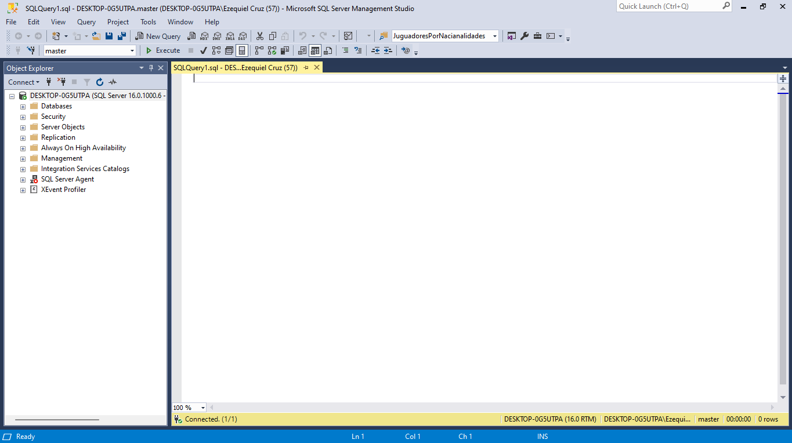

# Practica 
# implementing Dimensions and fact tables

En esta práctica, se implementará un almacén de datos utilizando la base de datos de ejemplo AdventureWorksDW2012 como fuente de datos. No se creará un área de preparación de datos explícita; en su lugar, se utilizará la base de datos de muestra AdventureWorksDW2012 como el área de preparación de datos.

Si surge algún problema al completar un ejercicio, se pueden instalar los proyectos completos desde la carpeta Solución proporcionada con el contenido complementario de este capítulo y lección.

## Ejercicio 1: Crear una base de datos de almacén de datos y una secuencia

En este ejercicio, se creará una base de datos de SQL Server para el almacén de datos.

1. Inicie SSMS y conéctese a su instancia de SQL Server. Abra una nueva ventana de consulta haciendo clic en el botón "Nueva consulta".




2. Desde el contexto de la base de datos maestra, cree una nueva base de datos llamada `tk463DW`. Antes de crear la base de datos, compruebe si existe y suéltela si es necesario.

```sql
USE master;
IF DB_ID('TK463DW') IS NOT NULL
DROP DATABASE TK463DW;
GO

```


 La base de datos debe tener las siguientes propiedades:
   - Debe tener un solo archivo de datos y un solo archivo de registro en la carpeta `TK463`.
   - El archivo de datos debe tener un tamaño inicial de 300 MB y estar habilitado para el crecimiento automático en fragmentos de 10 MB.
   - El tamaño del archivo de registro debe ser de 50 MB, con un 10% de crecimiento automático.
3. Después de crear la base de datos, cambie el modelo de recuperación a Simple.

```sql
CREATE DATABASE TK463DW
ON PRIMARY
(NAME = N'TK463DW', FILENAME = N'C:\TK463\TK463DW.mdf',
SIZE = 307200KB , FILEGROWTH = 10240KB )
LOG ON
(NAME = N'TK463DW_log', FILENAME = N'C:\TK463\TK463DW_log.ldf',
SIZE = 51200KB , FILEGROWTH = 10%);
GO

```


# Carpeta en C:


 modelo de recuperación a Simple.
 ```sql
ALTER DATABASE TK463DW SET RECOVERY SIMPLE WITH NO_WAIT;
GO
```


4. En su nuevo almacén de datos, cree un objeto de secuencia. Nómbrelo
seqcustomerDwkey. Comience a numerar con 1 y use un incremento de 1. Para otras
Practica opciones de secuencia, use los valores predeterminados de SQL Server. Puedes usar el
siguiente código.

 ```sql
USE TK463DW;
GO
IF OBJECT_ID('dbo.SeqCustomerDwKey','SO') IS NOT NULL
DROP SEQUENCE dbo.SeqCustomerDwKey;
GO
CREATE SEQUENCE dbo.SeqCustomerDwKey AS INT
START WITH 1
INCREMENT BY 1;
GO
```


# Ejercicio 2. Creando Dimensiones

En este ejercicio, creará la dimensión Clientes, para lo cual tendrá que implementar muchos de los
conocimientos adquiridos en este capítulo y en el anterior. En la base de datos Adventure
WorksDW2012, la dimensión DimCustomer, que servirá como fuente para la dimensión
Customers, está parcialmente cubierta de nieve. Tiene una tabla de búsqueda de un nivel llamada
DimGeography. Desnormalizarás completamente esta dimensión. Además, agregará las columnas
necesarias para admitir una dimensión SCD Tipo 2 y un par de columnas calculadas. Además de la
dimensión Clientes, creará las dimensiones Productos y Fechas.

1. Crear la Dimensión Customers. El origen de esta dimensión es la dimensión DimCustomer
de la base de datos de ejemplo AdventureWorksDW2012. Agregue una columna de clave
sustituta llamada customerDwkey y cree una restricción de clave principal en esta
columna. Utilice la Tabla 2-1 para obtener la información necesaria para definir las
columnas de la tabla y para completar la tabla.


Crear la Dimensión Customers.

```sql
CREATE TABLE dbo.Customers
(
CustomerDwKey INT NOT NULL,
CustomerKey INT NOT NULL,
FullName NVARCHAR(150) NULL,
EmailAddress NVARCHAR(50) NULL,
BirthDate DATE NULL,
MaritalStatus NCHAR(1) NULL,
Gender NCHAR(1) NULL,
Education NVARCHAR(40) NULL,
Occupation NVARCHAR(100) NULL,
City NVARCHAR(30) NULL,
StateProvince NVARCHAR(50) NULL,
CountryRegion NVARCHAR(50) NULL,
Age AS
CASE
WHEN DATEDIFF(yy, BirthDate, CURRENT_TIMESTAMP) <= 40
THEN 'Younger'
WHEN DATEDIFF(yy, BirthDate, CURRENT_TIMESTAMP) > 50
THEN 'Older'
ELSE 'Middle Age'
END,

CurrentFlag BIT NOT NULL DEFAULT 1,
CONSTRAINT PK_Customers PRIMARY KEY (CustomerDwKey)
);
GO
```


3. Cree la dimensión Productos. El origen de esta dimensión es la dimensión DimProducts de
la base de datos de ejemplo AdventureWorksDW2012. Utilice la Tabla 2-2 para obtener la
información que necesita para crear y completar esta tabla.
Cree la dimensión Fechas. El origen de esta dimensión es la dimensión DimDate de la base de
  datos de muestra AdventureWorksDW2012. Utilice la Tabla 2-3 para obtener la información que
  necesita para crear y completar esta tabla.

```sql
Create table dbo.Products
(
ProductKey int not null,
ProductName nvarchar(50) null,
Color nvarchar(50) null,
Size nvarchar (50) null,
SubcategoryName nvarchar(50)null,
CategoryName nvarchar (50)null,
constraint PK_Products primary key (ProductKey));

create table dbo.Dates
(
DateKey int not null,
FullDate date not null,
MonthNumberName nvarchar(20) null,
CalendarQuarter tinyint null,
CalendarYear smallint null,
constraint pk_Dates primary key (DateKey));

```


# EJERCICIO 3 Crear una tabla de hechos

En este ejemplo simplificado de un almacén de datos real, creará una única tabla de hechos. En este
ejemplo, no puede usar todas las claves externas juntas como una clave principal compuesta,
porque el origen de esta tabla, la tabla FactInternatSales de la base de datos
AdventureWorksDW2012, tiene una granularidad más baja que la tabla de hechos que está creando,
y la clave principal se duplicaría. Puede utilizar las columnas SalesOrderNumber y
SalesOrderLineNumber como clave principal, como en una tabla de origen; sin embargo, para
mostrar cómo puede autonumerar una columna con la propiedad IDENTIDAD, este ejercicio le pide
que agregue su propia columna de enteros con esta propiedad. Esta será su clave sustituta.


1. Cree la tabla de hechos InternetSales. El origen de esta tabla de hechos es la tabla de
hechos FactInternetSales de la base de datos de ejemplo AdventureWorksDW2012.
Agregue claves foráneas de las tres dimensiones creadas en el Ejercicio 2 de esta lección.
Agregue una columna de enteros por la propiedad IDENTIDAD y utilícela como clave
principal. Use la Tabla 2-4 para obtener la información necesaria para definir las columnas
de la tabla.

```sql
CREATE TABLE dbo.InternetSales
(
    InternetSalesKey INT NOT NULL IDENTITY(1,1),
    CustomerDwKey INT NOT NULL,
    ProductKey INT NOT NULL,
    DateKey INT NOT NULL,
    OrderQuantity SMALLINT NOT NULL DEFAULT 0,
    SalesAmount MONEY NOT NULL DEFAULT 0,
    UnitPrice MONEY NOT NULL DEFAULT 0,
    DiscountAmount FLOAT NOT NULL DEFAULT 0,
    CONSTRAINT FK_InternetSales_Customers
        FOREIGN KEY (CustomerDwKey) REFERENCES dbo.Customers(CustomerDwKey),
    CONSTRAINT FK_InternetSales_Products
        FOREIGN KEY (ProductKey) REFERENCES dbo.Products(ProductKey),
    CONSTRAINT FK_InternetSales_Dates
        FOREIGN KEY (DateKey) REFERENCES dbo.Dates(DateKey),
    CONSTRAINT PK_InternetSales
        PRIMARY KEY (InternetSalesKey)
);


```


Modifique la tabla de hechos InternetSales para agregar restricciones de clave externa para
las relaciones con las tres dimensiones. El código se muestra en el siguiente listado.

```sql

ALTER TABLE dbo.InternetSales ADD CONSTRAINT
FK_InternetSales_Customers_New FOREIGN KEY(CustomerDwKey)
REFERENCES dbo.Customers (CustomerDwKey);
ALTER TABLE dbo.InternetSales ADD CONSTRAINT
FK_InternetSales_Products_New FOREIGN KEY(ProductKey)
REFERENCES dbo.Products (ProductKey);
ALTER TABLE dbo.InternetSales ADD CONSTRAINT
FK_InternetSales_Dates_New FOREIGN KEY(DateKey)
REFERENCES dbo.Dates (DateKey);
GO


```


3. Cree un diagrama de base de datos, como se muestra en la Figura 2-1. Nómbrelo
internetsalesDW y guárdelo.


