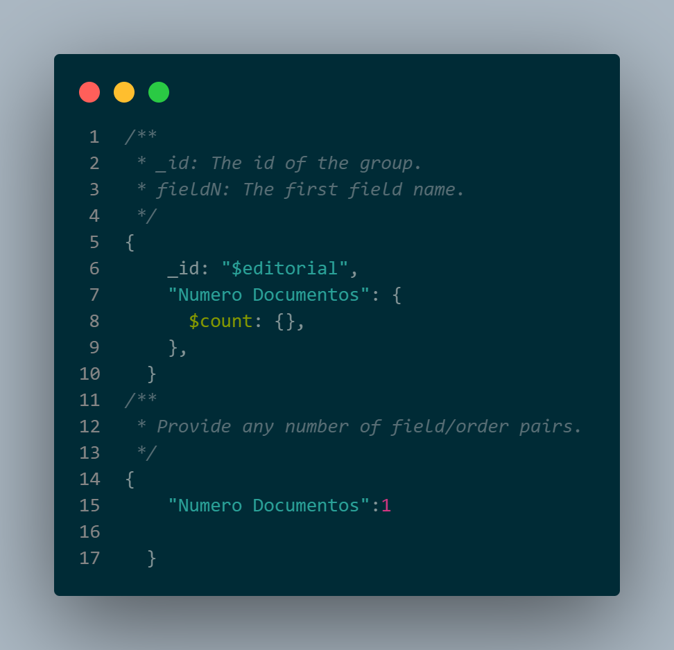
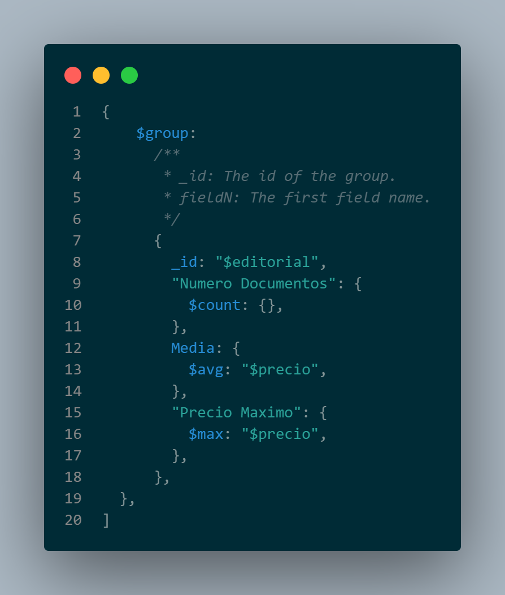
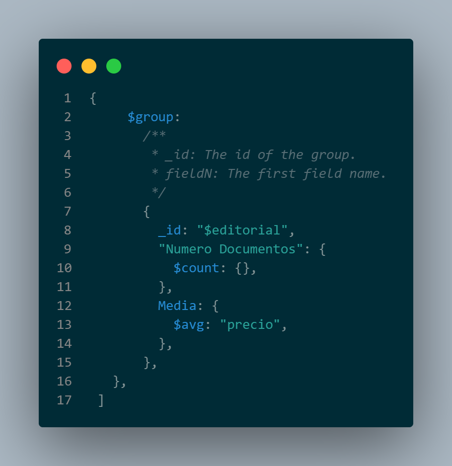
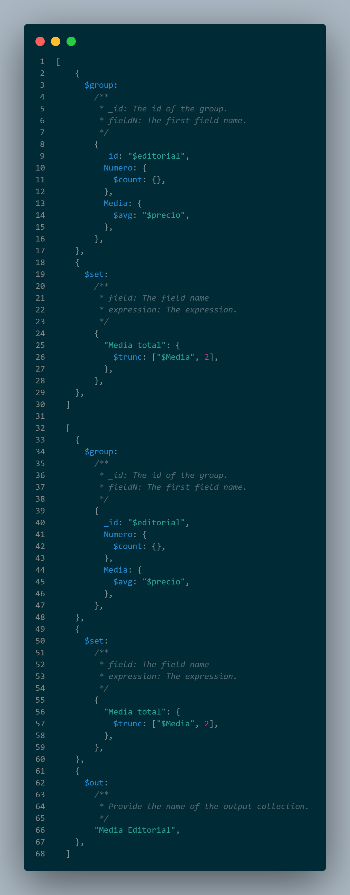
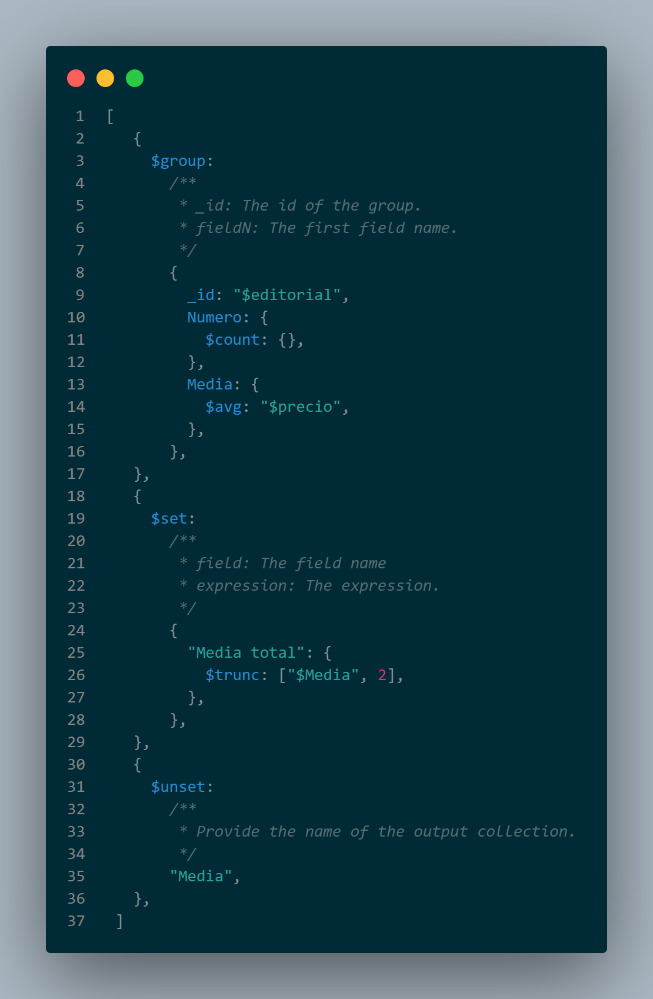
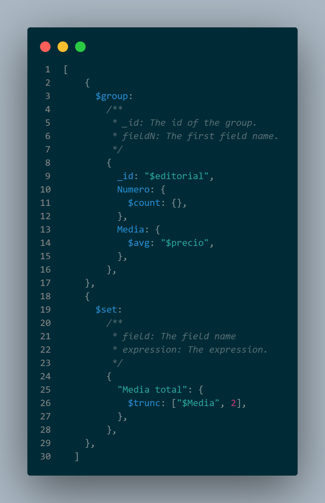

# Ejemplo de Agregaciones

Aquí se presentan algunos ejemplos de agregaciones realizadas utilizando MongoDB Compass:

## 1. Agregación con Group

### Descripción
Esta agregación utiliza el operador $group para agrupar documentos según un campo específico y realizar operaciones de agregación en los grupos resultantes.

## 2. Agregación con Group-Max

### Descripción
 En esta agregación, se utiliza $group junto con el operador $max para obtener el valor máximo de un campo dentro de cada grupo.

## 3. Agregación con Group-Media

### Descripción
Aquí, la agregación emplea $group junto con el operador $avg para calcular el valor medio de un campo dentro de cada grupo.

## 4. Agregación por Group-Set-Out

### Descripción
Esta agregación utiliza $group para agrupar documentos y luego $set y $out para crear una nueva colección con los resultados.

## 5. Agregación con Group-set-unset

### Descripción
 En este ejemplo, se utiliza $group, $set y $unset para realizar transformaciones en los documentos agrupados antes de almacenar el resultado en una nueva colección.

## 6. Agregación con Group-Trunc

### Descripción
 Aquí, $group se utiliza junto con el operador $trunc para truncar los valores de un campo dentro de cada grupo a un número especificado de decimales.

