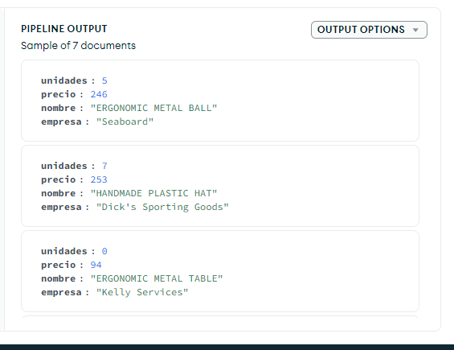
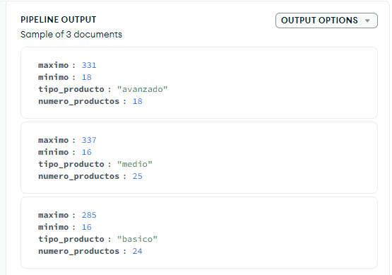

## Práctica de Agregaciones en MongoDB

Para realizar esta práctica, vamos a cargar unos datos ficticios de empresas desde un archivo denominado "productos.json" que se encuentra en los recursos de esta actividad. A continuación, debemos crear una base de datos y agregar los documentos de productos. Cada documento contiene información de productos, como el fabricante, unidades y similares.

### Consultas:

1. **Contar los productos de tipo "medio":** Usando un método básico.

```json
[
  {
    $match:
      /**
       * query: The query in MQL.
       */
      {
        tipo: "medio",
      },
  },
  {
    $count:
      /**
       * Provide the field name for the count.
       */
      "Productos Total Medios",
  },
]
```

   - 

2. **Indicar con un distinct las empresas (fabricantes) que hay en la colección.**

```json
[
  {
    $group: {
      _id: "$fabricante",
    },
  },
  {
    $project:
      /**
       * specifications: The fields to
       *   include or exclude.
       */
      {
        _id: 1,
      },
  },
]

```
   - 

3. **Visualizar los productos que tengan más de 80 unidades utilizando agregación.**
```json

[
  {
    $match:
      /**
       * query: The query in MQL.
       */
      {
        unidades: {
          $gt: 80,
        },
      },
  },
]
```

   - 

4. **Visualizar solo el nombre, unidades y precio de los productos que tengan menos de 10 unidades con $project.**
```json
[
  {
    $match:
      /**
       * specifications: The fields to
       *   include or exclude.
       */
      {
        unidades: {
          $lt: 10,
        },
      },
  },
  {
    $project:
      /**
       * specifications: The fields to
       *   include or exclude.
       */
      {
        nombre: 1,
        unidades: 1,
        precio: 1,
        _id: 0,
      },
  },
]

```
   - 

5. **Poner el fabricante, cambiando el nombre por "empresa" y utilizando $project.**
```json
[
  {
    $match:
      /**
       * query: The query in MQL.
       */
      {
        unidades: {
          $lt: 10,
        },
      },
  },
  {
    $project:
      /**
       * specifications: The fields to
       *   include or exclude.
       */
      {
        unidades: 1,
        precio: 1,
        empresa: "$fabricante",
        _id: 0,
      },
  },
]
```
   -  

6. **Añadir un campo calculado llamado "total" que multiplique precio por unidades.**
```json
[
  {
    $match:
      /**
       * query: The query in MQL.
       */

      {
        unidades: {
          $lt: 10,
        },
      },
  },
  {
    $project:
      /**
       * specifications: The fields to
       *   include or exclude.
       */
      {
        unidades: 1,
        precio: 1,
        empresa: "$fabricante",
        _id: 0,
      },
  },
  {
    $addFields:
      /**
       * newField: The new field name.
       * expression: The new field expression.
       */
      {
        total: {
          $multiply: ["$precio", "$unidades"],
        },
      },
  },
]

```

   - 

7. **Hacer que el nombre salga en mayúsculas con $toUpper.**
```json
[
  {
    $match:
      /**
       * query: The query in MQL.
       */
      {
        unidades: {
          $lt: 10,
        },
      },
  },
  {
    $project: {
      nombre: {
        $toUpper: "$nombre",
      },
      unidades: 1,
      precio: 1,
      empresa: "$fabricante",
      _id: 0,
    },
  },
  // {
  //   $project: {
  //     total: {
  //       $multiply: ["$precio", "$unidades"],
  //     },
  //   },
  // }
]

```

   - 

8. **Añadir un campo calculado que concatene el nombre del producto y el tipo utilizando $concat.**
```json
[
  {
    $match:
      /**
       * query: The query in MQL.
       */
      {
        unidades: {
          $lt: 10,
        },
      },
  },
  {
    $project:
      /**
       * newField: The new field name.
       * expression: The new field expression.
       */
      {
        _id: 0,
        nombre: 1,
        unidades: 1,
        precio: 1,
        empresa: "$fabricante",
        total: {
          $multiply: ["$precio", "$unidades"],
        },
        completo: {
          $concat: ["$nombre", " - ", "$tipo"],
        },
      },
  },
]

```
   - 

9. **Ordenar el resultado por el campo "total".**
```json
[
  {
    $match:
      /**
       * Provide the field name for the count.
       */
      {
        unidades: {
          $lt: 10,
        },
      },
  },
  {
    $project:
      /**
       * specifications: The fields to
       *   include or exclude.
       */

      {
        _id: 0,
        nombre: 1,
        unidades: 1,
        precio: 1,
        empresa: "$fabricante",
        total: {
          $multiply: ["$precio", "$unidades"],
        },
        completo: {
          $concat: ["$nombre", " - ", "$tipo"],
        },
      },
  },
  {
    $sort:
      /**
       * Provide any number of field/order pairs.
       */
      {
        total: 1,
      },
  },
]

```
   -  

10. **Averiguar el número de productos por tipo de producto.**
```json
[
  {
    $group:
      /**
       * _id: The id of the group.
       * fieldN: The first field name.
       */
      {
        _id: "$tipo",
        numero_Productos: {
          $sum: 1,
        },
      },
  },
  {
    $project:
      /**
       * specifications: The fields to
       *   include or exclude.
       */
      {
        "tipo Producto": "$_id",
        numero_producto: "$numero_Productos",
        _id: 0,
      },
  },
]

```

- 

11. **Añadir el valor mayor y el menor.**
```json
[
  {
    $group: {
      _id: "$tipo",
      numero_productos: {
        $sum: 1,
      },
      maximo: {
        $max: "$precio",
      },
      minimo: {
        $min: "$precio",
      },
    },
  },
  {
    $project: {
      tipo_producto: "$_id",
      numero_productos: "$numero_productos",
      maximo: 1,
      minimo: 1,
      _id: 0,
    },
  },
]

```
- Imagen: 

12. **Añadir el total de unidades por cada tipo.**
```json
[
  {
    $group: {
      _id: "$tipo",
      numero_productos: { $sum: 1 },
      maximo: { $max: "$precio" },
      minimo: { $min: "$precio" },
      total_unidades: { $sum: "$unidades" },
    },
  },
  {
    $project: {
      tipo_producto: "$_id",
      numero_productos: 1,
      maximo: 1,
      minimo: 1,
      total_unidades: 1,
      _id: 0,
    },
  },
]

```

-  

13. **Visualizar todos los datos del producto "Small Metal Tuna" y los primeros 5 caracteres del nombre usando $set y $substr.**
```json
[
  {
    $match: {
      nombre: "Small Metal Tuna",
    },
  },
  {
    $set: {
      nombre: {
        $substr: ["$nombre", 0, 5],
      },
    },
  },
]

```

-  

14. **Crear una salida que tenga el nombre del artículo y el total (precio por unidades) y guardarla en una colección denominada productos2.**
```json

[
  {
    $project:
      /**
       * specifications: The fields to
       *   include or exclude.
       */
      {
        _id: 0,
        nombre: 1,
        total: {
          $multiply: ["$precio", "$unidades"],
        },
      },
  },
  {
    $out:
      /**
       * Provide the name of the output collection.
       */
      "productos2",
  },
]

```
-  

15. **Crear una salida que tenga el nombre del artículo y el total (precio por unidades) y guardarla en una colección denominada productos2.**
```json


```


16. **Comprobar que se ha creado la colección productos2.**


17. **Hacer un find para comprobar el resultado.**


